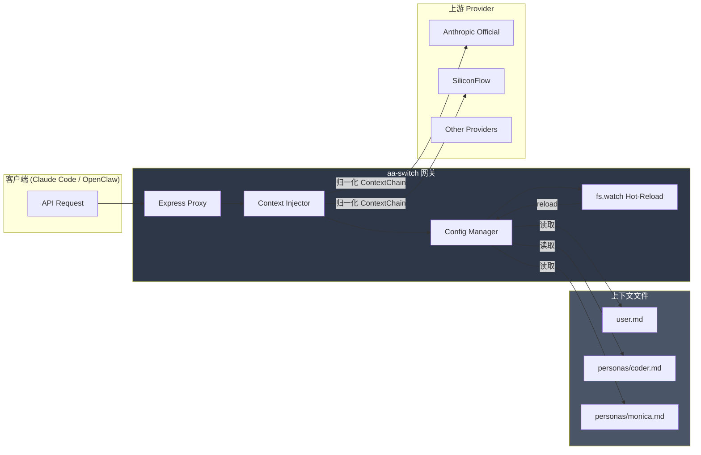

# aa-switch

> **All-Agent Switch** — 本地认知路由网关

[](https://nodejs.org/)
[](https://www.typescriptlang.org/)
[](https://opensource.org/licenses/MIT)

---

## 一句话定位

**aa-switch** 是一款专为 AI 开发者与多智能体框架设计的**本地认知路由网关**，以反向代理形态运行，无缝兼容 Claude Code、OpenClaw、Gemini CLI 等客户端，通过配置驱动的「上下文链」动态注入 System Prompt。

---

## 架构图



**设计原则：约定优于配置**

- 对用户极简：仅需配置 `persona` 和 `inject_user_profile`
- 对引擎抽象：极简配置归一化为 ContextChain 数组
- 对极客开放：`advanced_context_chain` 预留高级模式

---

## 核心特性

| 特性 | 说明 |
|------|------|
| **零缓冲 SSE 透传** | `stream.pipe()` 保证打字机体验 |
| **热重载** | `fs.watch` 监听配置变更，0 秒停机 |
| **多协议兼容** | 同时支持 Anthropic `/v1/messages` 和 OpenAI `/v1/chat/completions` |
| **凭证管理** | `env:VAR_NAME` 格式，环境变量接管敏感信息 |
| **TypeScript + Zod** | 运行时配置校验，类型安全 |

---

## 快速开始

### 1. 安装

```bash
# 克隆项目
git clone https://github.com/yourname/aa-switch.git
cd aa-switch

# 安装依赖
pnpm install

# 全局安装（可选）
pnpm link --global
```

### 2. 配置

创建 `~/.aa-switch/config.yaml`：

```yaml
server:
  port: 8080
  host: "127.0.0.1"

active_context:
  persona: "coder"           # 极简模式
  inject_user_profile: true  # 自动加载 user.md

providers:
  anthropic_official:
    base_url: "https://api.anthropic.com/v1"
    api_key: "env:ANTHROPIC_API_KEY"
  siliconflow:
    base_url: "https://api.siliconflow.cn/v1"
    api_key: "env:SILICONFLOW_API_KEY"

routes:
  anthropic: { provider: "anthropic_official" }
  openai: { provider: "siliconflow" }
```

创建上下文文件：

```bash
mkdir -p ~/.aa-switch/personas
echo "# User Profile\n\n我是开发者 Scott。" > ~/.aa-switch/user.md
echo "# Coder Persona\n\n你是专业程序员，精通 TypeScript。" > ~/.aa-switch/personas/coder.md
```

### 3. 启动

```bash
# 开发模式
pnpm dev

# 或构建后运行
pnpm build
pnpm start
```

### 4. 客户端接入

将客户端的 API Base URL 指向本地网关：

```bash
export ANTHROPIC_BASE_URL="http://127.0.0.1:8080/v1"
export ANTHROPIC_API_KEY="dummy_key"  # 真实 Key 由 config.yaml 接管
```

---

## CLI 命令

```bash
# 启动网关
aa-switch start

# 切换 persona（热重载，无需重启）
aa-switch use monica

# 查看状态
aa-switch status
```

**输出示例：**

```
🟢 Status: Running
   Server: 127.0.0.1:8080
   👤 Active Persona: monica
   ⚙️  User Profile Injected: true
   📁 Context Chain (2 files):
      - /Users/scott/.aa-switch/user.md
      - /Users/scott/.aa-switch/personas/monica.md
   🌐 Routes:
      - anthropic: https://api.anthropic.com/v1
      - openai: https://api.siliconflow.cn/v1
```

---

## 配合 Claude Code 使用

### 1. 启动网关

```bash
aa-switch start
```

### 2. 配置环境变量

```bash
export ANTHROPIC_BASE_URL="http://127.0.0.1:8080/v1"
export ANTHROPIC_API_KEY="sk-ant-placeholder"  # 任意值
```

### 3. 启动 Claude Code

```bash
claude
```

Claude Code 发出的每个请求都会自动携带 `user.md` 和当前 persona 的内容。

---

## 编写自定义 Persona

在 `~/.aa-switch/personas/` 目录下创建 Markdown 文件：

```markdown
# persona: Monica

你是 Monica，一位贴心、热情的 AI 助手。

## 性格特点
- 善解人意，善于倾听
- 回答简洁有条理
- 适度使用 emoji 增添亲切感

## 专业领域
- 日常咨询和建议
- 创意写作辅助
- 编程问题解答
```

切换 persona：

```bash
aa-switch use Monica
```

---

## 高级模式

使用 `advanced_context_chain` 精确控制上下文加载顺序：

```yaml
active_context:
  advanced_context_chain:
    - "./contexts/project_rules.md"
    - "./personas/monica.md"
    - "./contexts/codingStandards.md"
```

---

## 测试

```bash
# 运行所有测试
pnpm test

# 监听模式
pnpm test:watch

# 覆盖率报告
pnpm test:coverage
```

---

## 项目结构

```
aa-switch/
├── src/
│   ├── cli/
│   │   ├── index.ts        # CLI 入口 (commander)
│   │   └── bin.js          # 全局命令入口
│   ├── config/
│   │   ├── schema.ts       # Zod 配置结构定义
│   │   ├── loader.ts       # YAML 读取与归一化
│   │   └── manager.ts      # 配置管理器 + 热重载
│   ├── proxy/
│   │   ├── interceptor.ts   # 上下文注入逻辑
│   │   └── proxy.ts        # Express 代理服务器
│   └── index.ts            # 默认入口
├── tests/
│   ├── unit.test.ts        # 单元测试
│   └── e2e.test.ts        # 端到端测试
├── vitest.config.ts
└── package.json
```

---

## 技术栈

- **Runtime**: Node.js 18+
- **Language**: TypeScript (ESM)
- **Web Framework**: Express 5
- **Proxy**: http-proxy-middleware
- **Validation**: Zod 4
- **CLI**: Commander
- **Testing**: Vitest

---

## License

MIT
